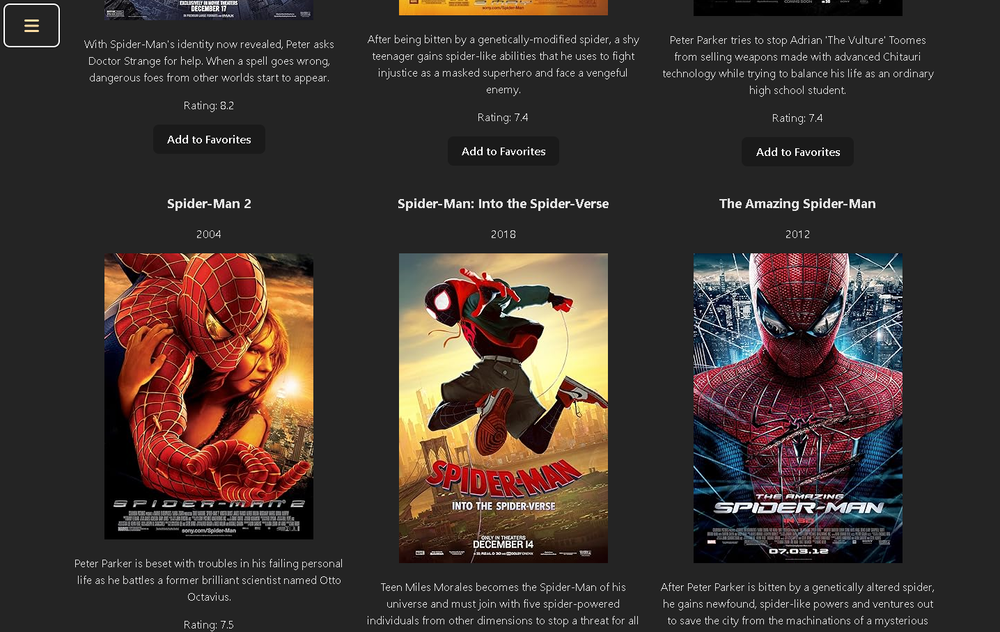
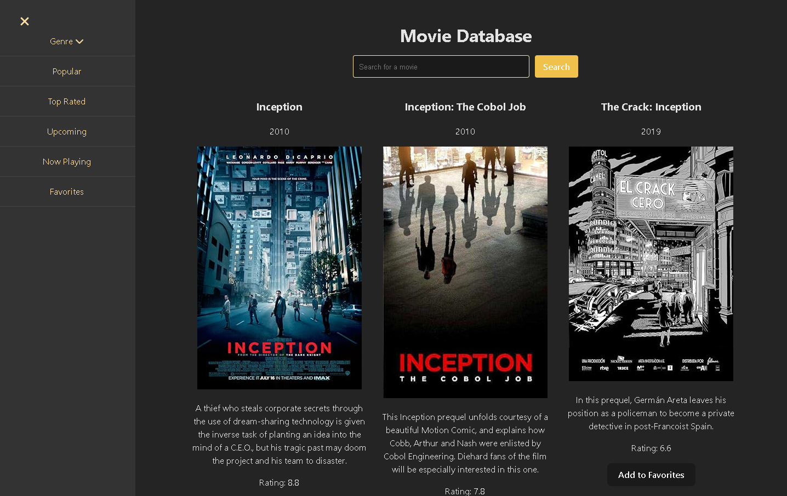
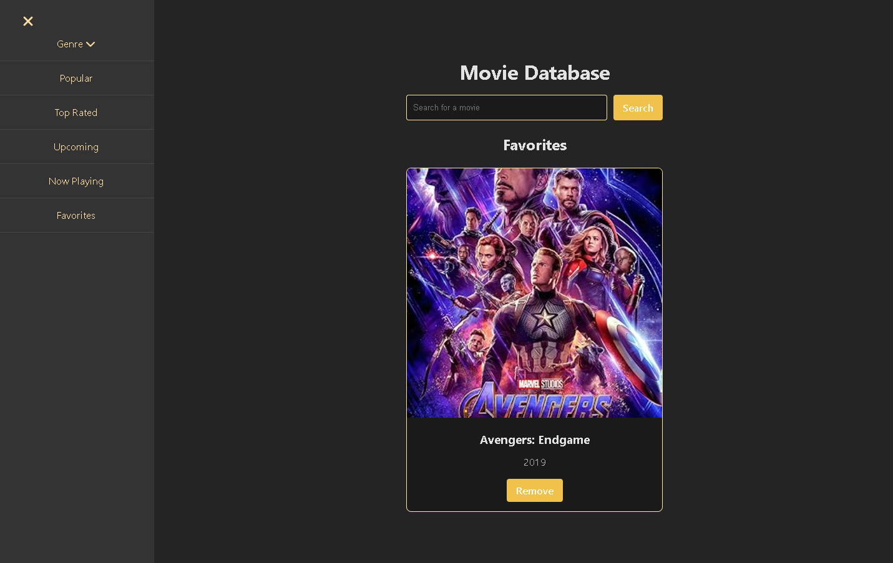
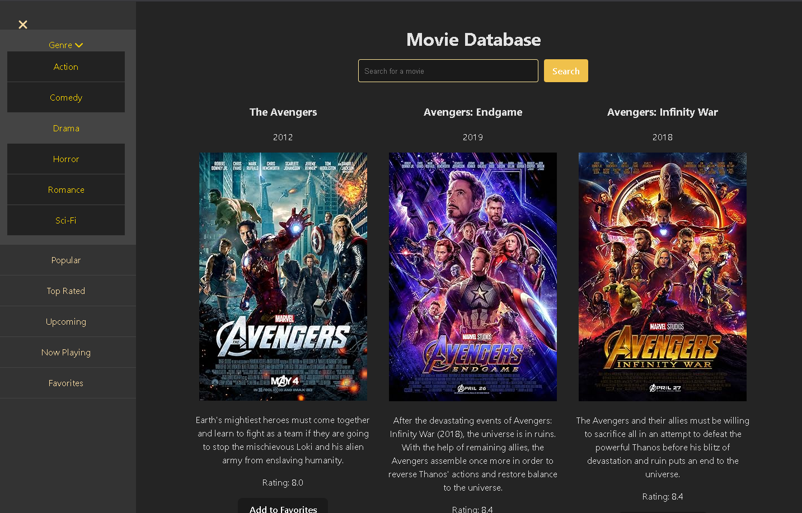

# 🎬 Movie Database App

A beautiful and responsive movie database application built with React that allows you to browse, search, and save your favorite movies.






## ✨ Features

- 🎥 Browse movies by different categories (Popular, Top Rated, Upcoming, Now Playing)
- 🔍 Search for any movie
- ❤️ Add movies to your favorites list
- 📱 Fully responsive design (works on mobile, tablet, and desktop)
- 🎨 Beautiful UI with smooth animations
- 🏷️ Filter movies by genre (Action, Comedy, Drama, Horror, Romance, Sci-Fi)

## 🚀 Technologies Used

- React.js
- Axios for API calls
- OMDB API
- Font Awesome for icons
- CSS3 for styling with modern techniques like Flexbox and Grid
- Responsive design with media queries

## 📦 Installation

1. Clone the repository:

```bash
git clone https://github.com/TAEMZ/Movie-Repo.git
```
